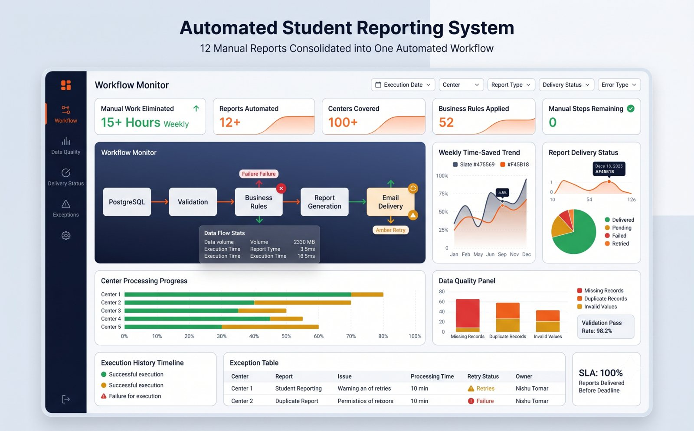
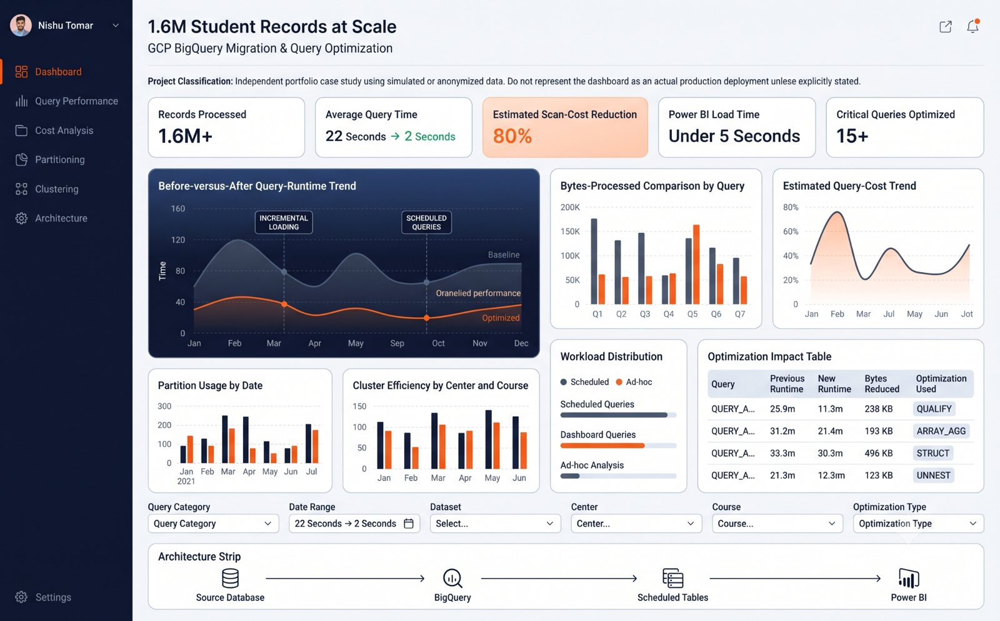

# Nishu Tomar | Business Data Analyst

[Portfolio](https://nishu-analytics-portfolio.tomarnishu63.chatgpt.site) · [LinkedIn](https://www.linkedin.com/in/nishutomar/) · [Email](mailto:nishutomarofficial@gmail.com)

I turn operational data into clear metrics, reliable reporting workflows and decisions. My background spans EdTech, customer-experience analytics, SQL, Power BI, Metabase, Python automation and requirements-led business analysis.

## Selected work

| Project | Decision supported | Stack | Evidence status |
|---|---|---|---|
| [Dealer NPS and call funnel](projects/01-dealer-nps/) | Which dealers and funnel stages need intervention? | MySQL, window functions, Power BI | Reconstructed from described professional methods; synthetic screen values |
| [Revenue, retention and batch utilization](projects/02-revenue-retention/) | Where are revenue, retention and capacity diverging? | Power BI, DAX, SQL | Anonymized portfolio reconstruction; illustrative financial values |
| [Automated student reporting](projects/03-reporting-automation/) | Which reports failed validation or delivery? | Python, Pandas, SQL | Reconstructed workflow with synthetic inputs |
| [BigQuery optimization lab](projects/04-bigquery-optimization/) | How should analytical workloads be partitioned and controlled? | BigQuery SQL, partitioning, clustering | Independent simulation; not a production deployment |
| [Airflow ETL monitoring](projects/05-airflow-etl/) | Is the daily data pipeline complete, fresh and within SLA? | Airflow, Python, PostgreSQL | Portfolio reconstruction based on automation experience |

## Featured dashboards

### Dealer NPS and call funnel


### Revenue, retention and batch utilization


### Automated student reporting


### BigQuery optimization lab


### Airflow ETL monitoring


## Repository structure

```text
projects/
  01-dealer-nps/              SQL ranking and funnel analysis
  02-revenue-retention/       KPI model and DAX measures
  03-reporting-automation/    Python reporting pipeline
  04-bigquery-optimization/   GoogleSQL optimization patterns
  05-airflow-etl/             Airflow DAG and validation modules
assets/                       Portfolio dashboard reconstructions
tests/                        Lightweight code checks
```

## How to review this portfolio

1. Open a project and read the business decision first.
2. Review its metric definitions and data grain.
3. Inspect the SQL or Python implementation.
4. Read validation checks before interpreting results.
5. Treat all demo outputs as synthetic unless a project explicitly states otherwise.

## Confidentiality and authorship

This repository contains no employer source data, credentials, production SQL, PBIX files or confidential screenshots. Dashboard images are portfolio reconstructions created with AI assistance. The analytical framing, documentation and example implementation are intended for demonstration and interview discussion.

## Contact

Available for analytics roles and scoped freelance work involving dashboard design, reporting automation, KPI frameworks, funnel analysis and data-quality reviews.

- Email: nishutomarofficial@gmail.com
- LinkedIn: https://www.linkedin.com/in/nishutomar/
- Portfolio: https://nishu-analytics-portfolio.tomarnishu63.chatgpt.site
