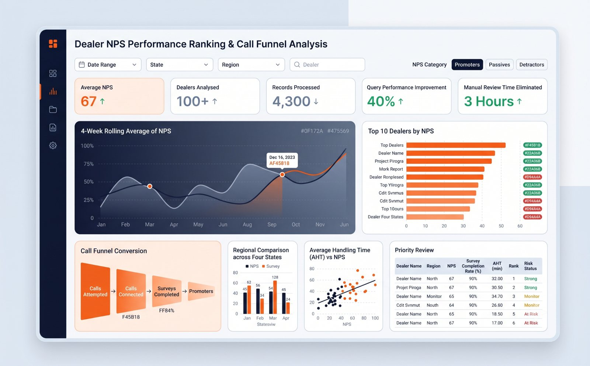

# Dealer NPS Performance Ranking and Call Funnel

## Business decision

Identify which dealers, regions and call-funnel stages require intervention before the next operating review.

## Data model

| Entity | Grain | Key fields |
|---|---|---|
| dealer | One row per dealer | dealer_id, dealer_name, region |
| call_log | One row per call attempt | call_id, dealer_id, customer_id, call_time, outcome |
| survey | One row per completed response | survey_id, dealer_id, customer_id, nps_score |
| message | One row per WhatsApp event | message_id, customer_id, status, event_time |

## KPI definitions

- **NPS:** percentage of promoters minus percentage of detractors among valid completed responses.
- **Connection rate:** connected calls divided by attempted calls.
- **Survey completion rate:** completed surveys divided by connected calls.
- **Four-week rolling NPS:** current and prior three weekly NPS values averaged within dealer.
- **Priority review:** demonstration rule for dealers below a chosen regional performance threshold.

## Analysis

1. Reconcile call attempts and distinct customers.
2. Calculate dealer and regional NPS with explicit valid-response exclusions.
3. Rank dealers within region.
4. Calculate rolling performance to reduce single-week noise.
5. Join funnel stages without multiplying events.

## Implementation

- [SQL analysis](sql/analysis.sql)
- [Validation checklist](docs/validation.md)

## Validation

The analysis checks score range, duplicate survey responses, zero denominators, event ordering and join multiplication.

## Evidence status

Professional reconstruction based on customer-experience analytics methods. The dashboard is not an original employer screenshot; its displayed values are illustrative. The 32% to approximately 39% conversion movement is retained from the current resume and should be described as associated with recommendations, not proven causality.
