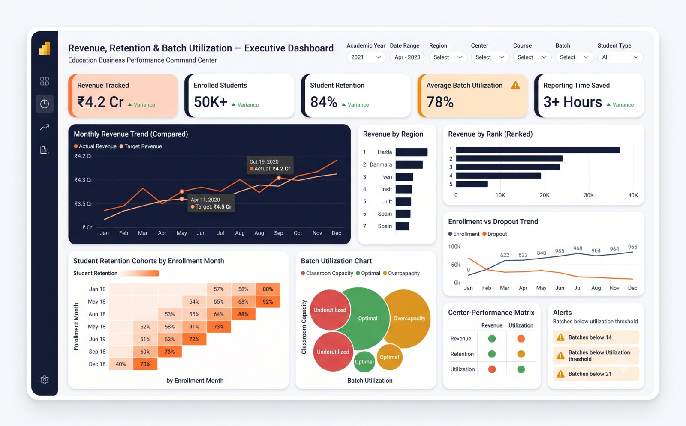

# Revenue Retention and Batch Utilization

## Business decision

Help academic and operating leaders determine where revenue, enrollment, retention and batch capacity are moving in different directions.

## Data model

| Entity | Grain | Key fields |
|---|---|---|
| enrollment | One student-course enrollment | student_id, batch_id, enrollment_date, fee_amount, status |
| batch | One row per batch | batch_id, center_id, course_id, capacity |
| center | One row per center | center_id, region |
| attendance | One student-session record | student_id, session_id, attended |

## KPI definitions

- **Recognized revenue:** fee amount included under an explicitly documented status and reporting date rule.
- **Retention:** active eligible students divided by the eligible starting cohort.
- **Batch utilization:** active enrolled students divided by operational capacity.
- **Dropout rate:** eligible cohort members marked dropped divided by the same starting cohort.

## Analysis

The model separates event facts from center, course and batch dimensions; cohort retention is measured using fixed entry groups rather than mixing new admissions into the denominator.

## Implementation

- [SQL model](sql/analysis.sql)
- [Power BI measures](docs/measures.md)
- [Validation checklist](docs/validation.md)

## Validation

Revenue is reconciled to status rules, cohort denominators are frozen, capacity is effective-dated and inactive batches are excluded deliberately.

## Evidence status

Anonymized professional reconstruction. The dashboard's revenue, retention and utilization values are illustrative and must not be presented as employer results.
