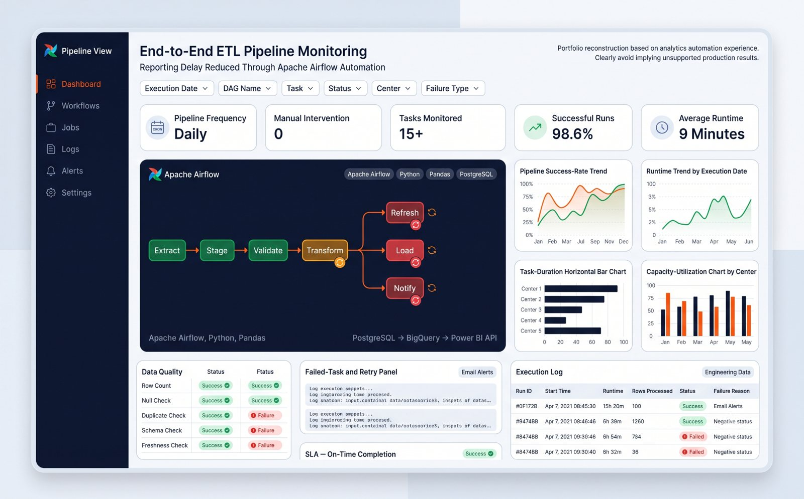

# Apache Airflow ETL Pipeline Monitoring



## Business decision

Determine whether the daily analytics pipeline is complete, fresh, validated and ready for dashboard consumption before operations begin.

## DAG design

```text
extract_postgres
       |
validate_source
       |
transform_metrics
       |
load_reporting
       |
refresh_bi
       |
notify_success
```

## Data model

The DAG assumes immutable raw extracts by run date, validated staging records at source grain and idempotent reporting partitions at the agreed dashboard grain.

## Operational controls

- Idempotent run-date processing
- Retries with bounded delay
- Source freshness and row-count checks
- Task-level failure notification
- Explicit dependencies
- No credentials inside source code

## Implementation

- [Airflow DAG](dags/student_analytics_dag.py)
- [Reusable validation functions](src/quality.py)
- [Runbook](docs/runbook.md)

## Validation

Source freshness, minimum row volume, required fields, uniqueness and reporting-partition reconciliation must pass before the BI refresh task runs.

## Evidence status

Portfolio reconstruction based on automation experience. The DAG is an illustrative template and is not represented as employer production code. Runtime, success-rate and latency values in the dashboard are simulated until the workflow is executed in a configured environment.
